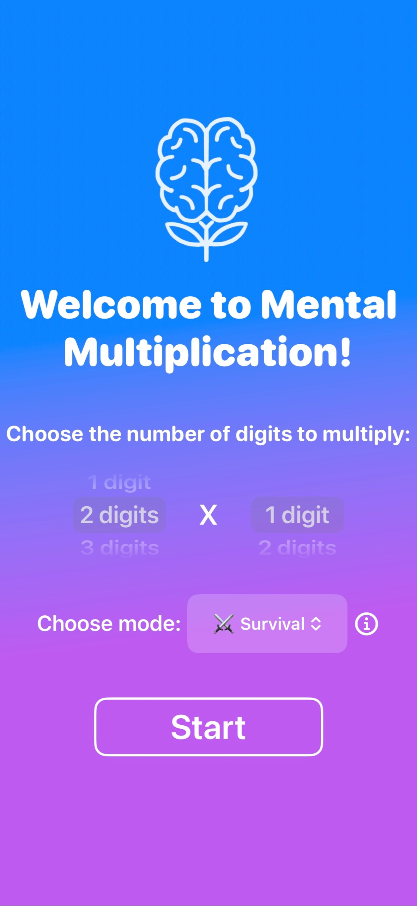

# Mental Multi

 
## Table of Contents
- [App Description](#app-description)
- [Game Modes](#game-modes)
- [App Preview](#app-preview)
- [Installation](#installation)
- [Tech Stack](#tech-stack)
- [Contact](#contact)

## App Description
Mental Multi is an iOS app built to help users level up their mental multiplication skills. It includes 4 game modes (explained below) designed to boost speed and accuracy. From simple 1x1 digit problems to challenging 3x3 digit calculations, Mental Multi welcomes all skill levels and ages. 

## Game Modes
🌷 Zen: No clock. No points. No streak. Relax and multiply at your own pace. 
⏱️ Timed: Solve each problem before time runs out! You have 3 lives to lose for being too slow, being incorrect, or skipping. 
⚔️ Survival: Keep the streak! Answer as many questions in a row as you can. Be careful — one mistake or skip, and it’s Game Over. 
⚡️ Blitz: You have 60 seconds to solve as many problems as possible. Each wrong answer or skip subtracts 3 seconds from the clock. 

## App Preview

  
  
  

## Installation
Mental Multi is available for iPhone and iPad on the App Store (compatible with iOS version 17.6 or later). 
Click to download: 

## Tech Stack
 

## Contact
✉️ Gmail: [brookescarrier@gmail.com](mailto:brookescarrier@gmail.com) 
🔗 LinkedIn: [Brooke Carrier](https://www.linkedin.com/in/brooke-carrier/) 

